# Lab 04: Implement a Secure Environment

## Lab scenario
The students will take the information gained in the lessons to configure and subsequently implement security in the Azure Portal and within the AdventureWorks database.

You have been hired as a Senior Database Administrator to help ensure the security of the database environment. These tasks will focus on Azure SQL Database.

>**Note:** These exercises ask you to copy and paste T-SQL code. Please verify that the code has been copied correctly, before executing the code.

## Lab objectives

In this lab, you will complete the following task:

- Task 1: Configure Azure SQL Database firewall rules

## Estimated timing: 30 minutes

## Architecture diagram

.png)

### Task 1 - Configure Azure SQL Database firewall rules

1. From the Azure Portal, search for **SQL servers (1)** in the search box at the top, then click **SQL servers (2)** from the list of options.

    

1. Select the server name **dp300-lab-<inject key="DeploymentID" enableCopy="false" />** to be taken to the detail page (you may have a different resource group and location assigned for your SQL server).

    

1. Select **Show networking settings**.

    

1. On the **Networking** page, click on **+ Add your client IPv4 address (your IP address) (1)**, in full **IP address (2)** is selected and then click **Save (3)**.

    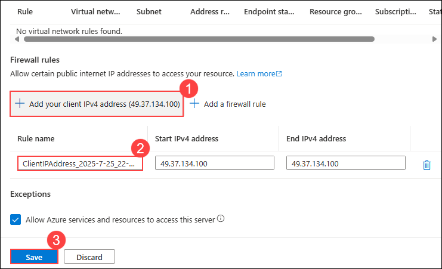

    >**Note:** Your client IP address was automatically entered for you. Adding your client IP address to the list will allow you to connect to your Azure SQL Database using SQL Server Management Studio or any other client tools. **Make note of your client IP address, you will use it later.**

1. In the windows search **SQL Server Management Studio (1)** and **select (2)** it in the labvm. On the Connect to Server dialog box, paste in the name of your Azure SQL Database server, and login with the credentials below:

    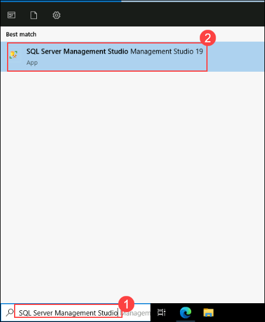
   

    - **Server name:** <inject key="sqlServerFqdn"></inject>  **(1)**
    - **Authentication:** SQL Server Authentication **(2)**
    - **login:** sqladmin **(3)**
    - **Password:** P@ssw0rd01 **(4)**
    - Click **Connect (5)**.

     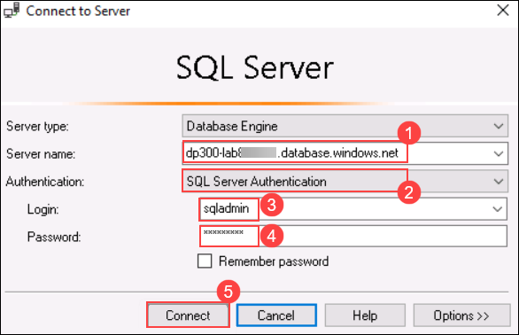

1. In Object Explorer expand the server node, and right click on **Databases**. Click **Import Data-tier Application**.

    

1. In the **Import Data Tier Application** dialog, click **Next** on the first screen.

    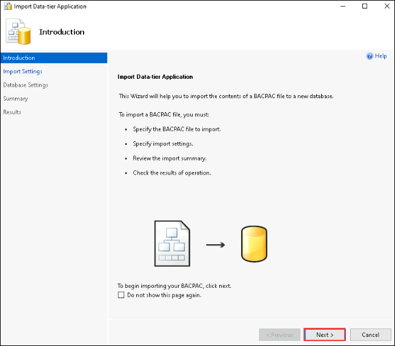
     
1. In the **Import Settings** screen, click **Browse** and navigate to **C:\LabFiles\SecureEnvironment (1)** folder, click on the **AdventureWorksLT.bacpac (2)** file, and then click **Open (3)**.

    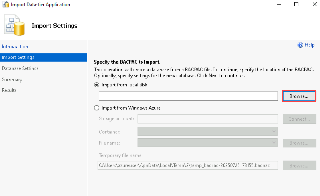

    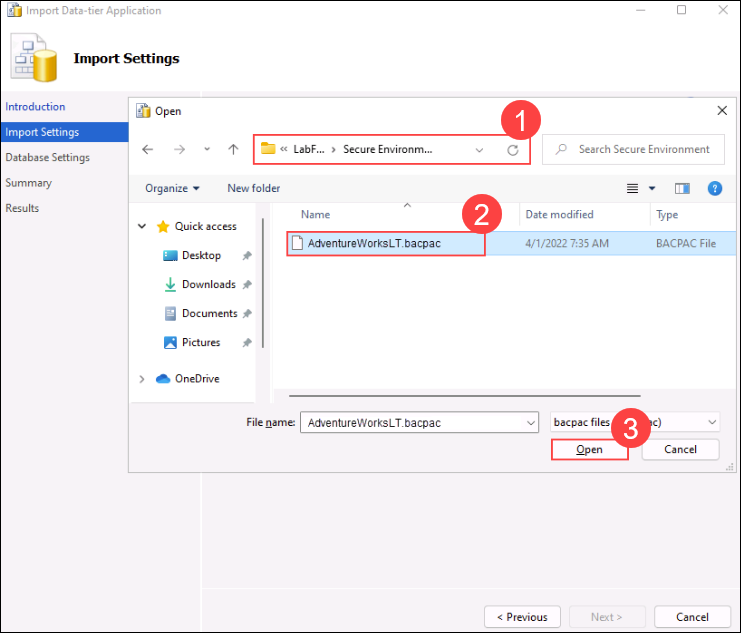

1.  Back to the **Import Data-tier Application** screen click **Next**.

    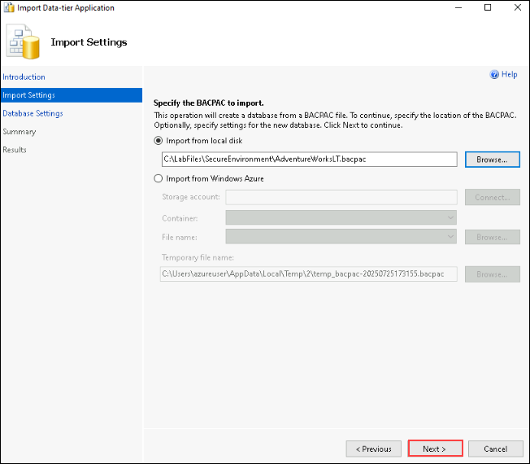

1. On the **Database Settings (1)** screen, make the changes as below:

    - **Database name:** AdventureWorksFromBacpac **(2)**
    - **Edition of Microsoft Azure SQL Database**: Basic **(3)**

    - Click **Next (4)**.

    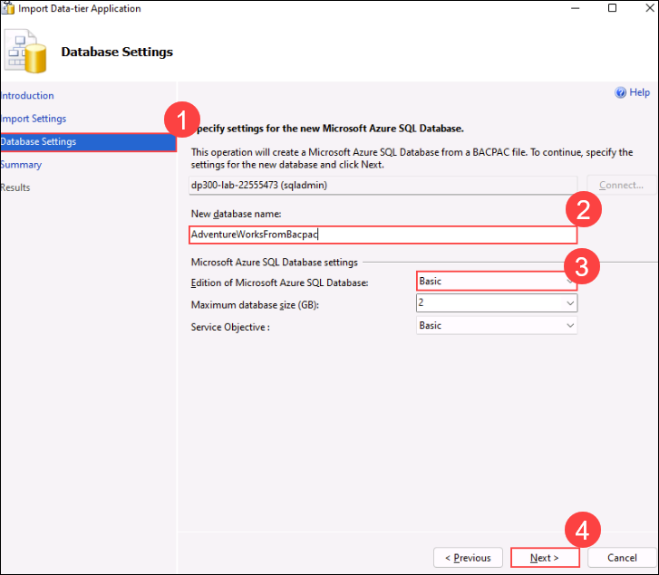

1. On the **Summary** screen click **Finish**. When your import completes you will see the results below. Then click **Close**.

    
     
     >**Note:** Please wait untill Operation complete successfully it might take sometime.

1. Back to SQL Server Management Studio, in **Object Explorer**, expand the **Databases** folder. Then right-click on **AdventureWorksFromBacpac** database, and then **New Query**.

    

1. Execute the following T-SQL query by pasting the text into your query window.
    1. **Important:** Replace **000.000.000.00** with your client IP address. Click **Execute** or press **F5**.

    ```sql
    EXECUTE sp_set_database_firewall_rule 
            @name = N'AWFirewallRule',
            @start_ip_address = '000.000.000.00', 
            @end_ip_address = '000.000.000.00'
    ```

1. Next you will create a contained user in the **AdventureWorksFromBacpac** database. Click **New Query** and execute the following T-SQL.

    ```sql
    USE [AdventureWorksFromBacpac]
    GO
    CREATE USER ContainedDemo WITH PASSWORD = 'P@ssw0rd01'
    ```

    

    >**Note:** This command creates a contained user within the **AdventureWorksFromBacpac** database. We will test this credential in the next step.

1. Navigate to the **Object Explorer**. Click on **Connectc(1)**, and then **Database Engine (2)**.

    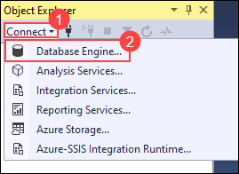

1. Attempt to connect with the credentials you created in the previous step. You will need to use the following information:

    - **Login:** ContainedDemo
    - **Password:** P@ssw0rd01

     Click **Connect**.

     You will receive the following error.

1. This error is generated because the connection attempted to login to the *master* database and not **AdventureWorksFromBacpac** where the user was created. Change the connection context by clicking **OK** to exit the error message.
    
    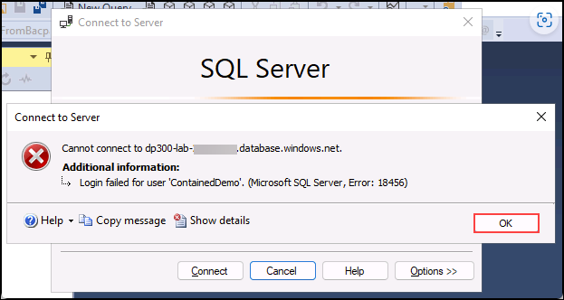

1. Then clicking on **Options >>** in the **Connect to Server** dialog box as shown below.

    

1. On the **Connection Properties** tab, type the database, type the name as **AdventureWorksFromBacpac (1)**, and then click **Connect (2)**.

    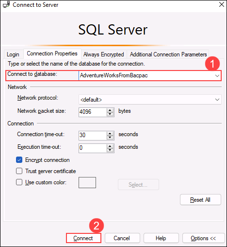

1. Notice that you were able to successfully authenticate using the **ContainedDemo** user. This time you were directly logged into **AdventureWorksFromBacpac**, which is the only database to which the newly created user has access to.

    
    
    
> **Congratulations** on completing the task! Now, it's time to validate it. Here are the steps:
- Click the Lab Validation tab located at the upper right corner of the lab guide section and navigate to the Lab Validation Page.
- Hit the Validate button for the corresponding task. If you receive a success message, you can proceed to the next task. 
- If not, carefully read the error message and retry the step, following the instructions in the lab guide.
- If you need any assistance, please contact us at labs-support@spektrasystems.com. We are available 24/7 to help you out.

<validation step="c0faf7e6-3918-4be9-b39a-46689b6d3696" />

>**Results:** In this exercise, you've configured server and database firewall rules to access a database hosted on Azure SQL Database. You've also used T-SQL statements to create a contained user, and used SQL Server Management Studio to check the access.

### Review
In this lab, you have completed:

- Configured Azure SQL Database firewall rules.

### You have successfully completed the lab.
