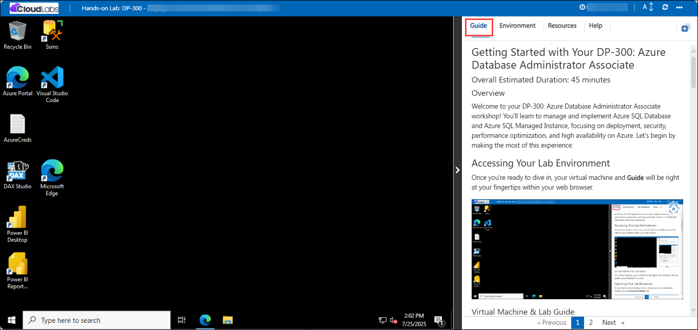
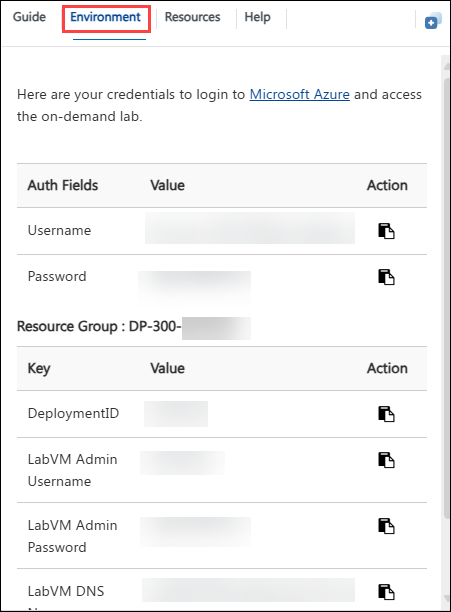
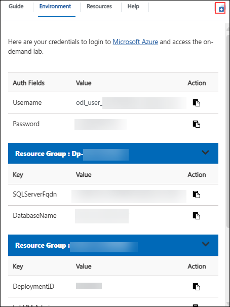
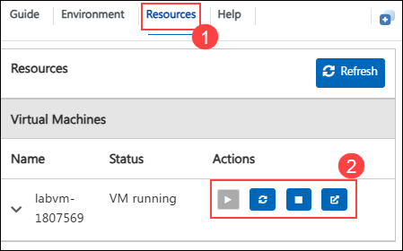
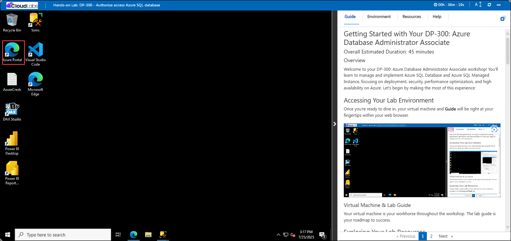
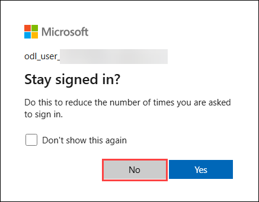
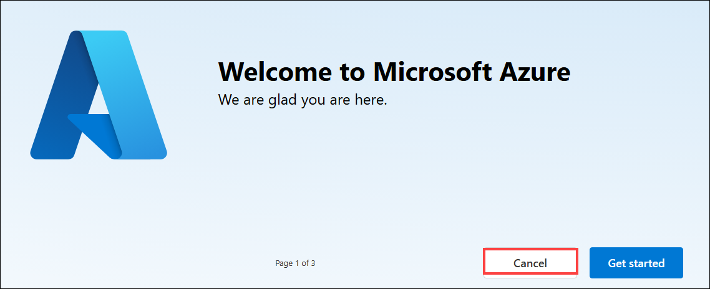

# Getting Started with Your DP-300: Azure Database Administrator Associate

### Overall Estimated Duration: 45 minutes

### Overview

Welcome to your DP-300: Azure Database Administrator Associate workshop! You'll learn to manage and implement Azure SQL Database and Azure SQL Managed Instance, focusing on deployment, security, performance optimization, and high availability on Azure. Let's begin by making the most of this experience:
 
## Accessing Your Lab Environment
 
Once you're ready to dive in, your virtual machine and **Guide** will be right at your fingertips within your web browser.
 

### Virtual Machine & Lab Guide
 
Your virtual machine is your workhorse throughout the workshop. The lab guide is your roadmap to success.
 
## Exploring Your Lab Resources
 
To get a better understanding of your lab resources and credentials, navigate to the **Environment** details tab.
 

## Utilizing the Split Window Feature
 
For convenience, you can open the lab guide in a separate window by selecting the **Split Window** button from the Top right corner.
 

 
## Managing Your Virtual Machine
 
Feel free to **start, stop, or restart(2)** your virtual machine as needed from the **Resources(1)** tab. Your experience is in your hands!
 

 ## Lab Guide Zoom In/Zoom Out

To adjust the zoom level for the environment page, click the **A↕ : 100%** icon located next to the timer in the lab environment.

## Let's Get Started with Azure Portal
 
1. On your virtual machine, click on the **Azure Portal** icon as shown below:
 
    

2. You'll see the **Sign into Microsoft Azure** tab. Here, enter your credentials:
 
   - **Email/Username:** <inject key="AzureAdUserEmail"></inject>
 
    
 
3. Next, provide your password:
 
   - **Password:** <inject key="AzureAdUserPassword"></inject>
 
   

4. If prompted to stay signed in, you can click **No**.

    

5. If a **Welcome to Microsoft Azure** pop-up window appears, simply click "**Cancel**" to skip the tour.

    

6. Click **Next** from the bottom right corner to embark on your Lab journey!
 
     
 
Now you're all set to explore the powerful world of technology. Feel free to reach out if you have any questions along the way. Enjoy your workshop!
